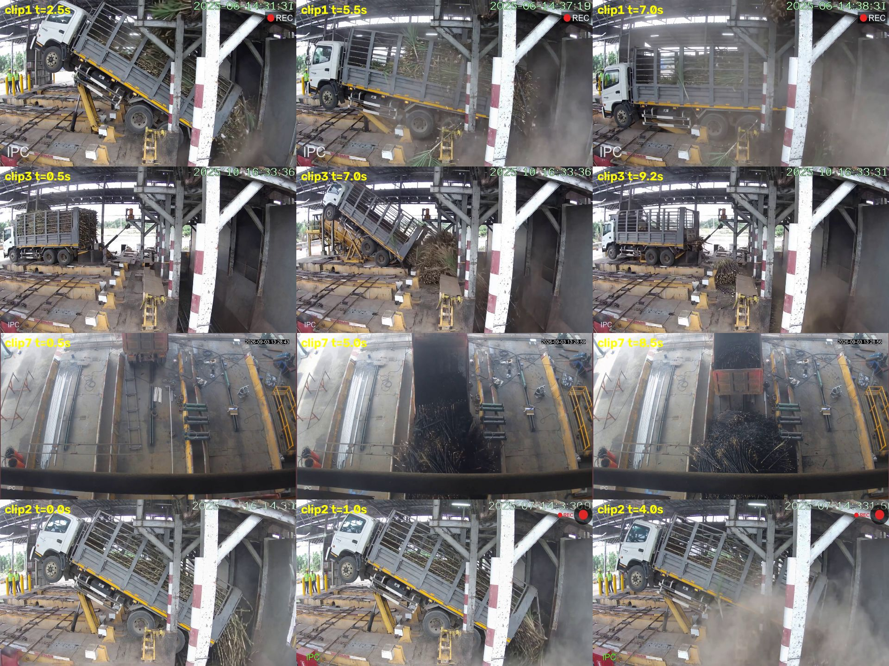

# Sugarcane CV — contamination detection at a mill delivery yard

Five detection problems from one real project: measuring what arrives on sugarcane
delivery trucks at a Thai sugar mill, from the mill's own CCTV and from cheap sensors
at the tipping bay.

Training code only — **no model weights, no customer footage.**
Every number below states the evidence it rests on — including the ones that do not hold up.

| # | Problem | Evidence | Status |
|---|---------|----------|--------|
| 1 | [Dust opacity during tipping](#1-dust-opacity) | synthetic only | shipped, unvalidated on real dust |
| 2 | [Burnt vs fresh cane](#2-burnt-vs-fresh-cane) | **8,612 real CCTV images** | works, camera-bound |
| 3 | [Burnt cane mixed into a fresh load](#3-burnt-cane-mixed-in) | simulated mixes | rule found, threshold unset |
| 4 | [Soil / trash / dirty area](#4-dirty-area) | 65 real images | inconclusive — data-bound |
| 5 | [Sand, rock and metal by sound](#5-acoustic-contaminants) | **real yard audio** | sand solved |
| 6 | [Stalk segmentation](#6-stalk-segmentation) | 31 hand labels | supporting work |

---

## 1. Dust opacity

Measures how opaque the dust cloud gets when a truck tips its load, per bay, and writes
an event log for mist-sprayer control and environmental reporting.

**Approach** — LR-ASPP segmentation with a density head (threshold 0.29), followed by a
*zone-evidence veto*: each bay's `detected%` is weighted by the fraction of pixels that
actually look like airborne haze. The veto removes false alarms from static black cane
piles and truck beds without retraining anything.

*Model generations compared on the same tipping clip.*

*Frames the base model flagged, reviewed against labels — the failure mode the veto targets.*

Before any learned model, the opacity equation itself was validated in simulation:

**The honest limitation.** Not one real photograph containing dust exists in the test set.
Every positive sample is AI-generated. The two real photographs available show an empty
yard, and both were training data. So every recall number here measures *pipeline
behaviour on synthetic input* — it is a logic test, not a field accuracy. Trustworthy
false-positive rates require a fresh set of empty-yard footage the model has never seen.

→ [`src/dust_opacity/`](src/dust_opacity/)

---

## 2. Burnt vs fresh cane

Burnt cane is penalised at the weighbridge, so classifying each truckload matters commercially.

**Data** — 8,612 real mill CCTV images, 4 classes, 6 days, 2 cameras (`MPDC00`, `MPK00`),
from the public `aimlsugarcane` Roboflow dataset (CC BY 4.0).

*Real burnt cane: pale grey-brown, dry matte stalks, leaves burned away.*

*Real fresh cane: leaves and sheaths still attached, lighter — not "green".*

**This killed the original pipeline.** Everything built before this audit assumed burnt cane
was *glossy black* and fresh cane was *green*. Real burnt cane is neither. The separating
feature is **leaves present / absent plus dry pale surface**, so all synthetic training data
and every colour rule derived from it were invalid.

**Results** — EfficientNet-B0 @384px, 6 epochs, 5-fold cross-validation:

| | recall | precision | accuracy |
|---|---|---|---|
| mean over 5 folds | 0.873 ±0.117 | 0.843 ±0.108 | 0.9586 ±0.0069 |
| worst fold | 0.711 | 0.658 | 0.9500 |

Mean F1 **0.854**, against a camera-only baseline of **0.417**.

**The catch, reported up front.** Class and camera are almost perfectly confounded — 94% of
burnt examples come from one camera, 79% of fresh from the other. A model can score well by
learning *which camera took the picture*. Split per camera, recall is **0.944 on MPDC00 and
0.415 on MPK00**. The lower number is the honest one. Every result in this repo is reported
per camera for that reason.

→ [`src/burnt_classifier/`](src/burnt_classifier/)

---

## 3. Burnt cane mixed in

A load is rarely all-burnt or all-fresh. This asks what fraction of burnt surface is
detectable before the call flips.

*Burnt surface pixels composited onto a fresh pile — scattered patches vs one contiguous layer.*

**What the test settled:**

- **`black%` is useless.** Fresh cane in truck-bed shadow reads 36.6% dark; burnt cane reads
  43–60%. The ranges overlap, and texture gating does not separate them.
- **`bright%` works.** Burnt piles contain no bright stalks at all (0.6–6%). Fresh piles always
  do, even in shadow (19–21%). A clean 3× gap.
- The 8/15 cut-off is a placeholder from two clips and must be re-set on real footage.
- Snapshots must be taken while the bed is raised or after the dust settles — dust brightens
  the pile and breaks the rule.

→ [`src/burn_mixing/`](src/burn_mixing/)

---

## 4. Dirty area

Estimating the share of a load that is soil, tops and trash rather than millable cane.

*Annotation montage — the label standard itself is the bottleneck.*

**Result: inconclusive, and the reason is documented rather than hidden.**

- The `sugar-cane` class has **zero annotations** across all 158 images, so "fraction of the
  pile" cannot be computed. Only *dirty ÷ (dirty + clean labelled area)* is measurable, and
  that depends on how widely each annotator drew their boxes.
- The set is **65 original images**, Roboflow-augmented to 158. Real unit: 54 trucks.
- The published split leaks — one source image appears 3× in train and once in valid, which
  is 10% of a 10-image validation set.
- The cross-camera score of 0.842 **exactly equals** a majority-class baseline. The model
  learned nothing.

This does not show the task is impossible. It shows 65 images cannot decide it.

→ [`src/dirty_area/`](src/dirty_area/)

---

## 5. Acoustic contaminants

Metal, rock and sand riding in with the cane damage the shredder. Cameras cannot see inside
a load — microphones can hear it hit the carrier.

**Pipeline** — generate impact/sand SFX with Stable Audio Open on a GTX 1060, filter them
through an acceptance test (1–10 kHz energy ≥0.35, attack ≤20 ms, decay ≤800 ms, peak/mean ≥6),
mix into **real** tipping-yard background at SNR +12 → −12 dB with millisecond ground truth,
then train a log-mel CNN. 57 clips generated, 30 passed, 80 test clips, 418 events.

Tested against real yard audio the model never saw:

| method | impact R / P | sand R / P | false alarms/min |
|---|---|---|---|
| energy threshold rule | 0.58 / 0.25 | 0.35 / — | 7.6 |
| **CNN, 0.5 s window** | 0.47 / **0.59** | **0.94 / 1.00** | **2.2** |
| CNN, 0.25 s window | **0.59** / 0.35 | 0.98 / 0.995 | 7.2 |

**Sand flow is solved** — 94–98% recall at essentially perfect precision on real audio, the
strongest result in the project. The CNN beats the rule on precision by 2.4× and cuts false
alarms 3.5×, because it learns *not* to fire on cane hitting the rail, chains and hammers.

→ [`src/acoustic/`](src/acoustic/)

---

## 6. Stalk segmentation

Supporting work: separating individual stalks so downstream features (leaf fraction, stalk
length, orientation) can be measured rather than guessed from whole-image colour.

*Frozen DINOv2 backbone with a two-layer head, trained on 31 hand-labelled images.*

→ [`src/stalk_seg/`](src/stalk_seg/)

---

## How results are reported here

1. Numbers come from held-out data split along the structure that matters — by day and by
   camera, never a random shuffle.
2. Accuracy is always paired with coverage: how many cases the model agreed to answer.
3. Failures are written down with the same weight as successes. The burnt-cane colour
   assumption, the dirty-area dataset and the dust test set are all documented as unusable,
   because a number that cannot be defended is worse than no number.

The methodology this follows is packaged separately as
[`model-proof-loop`](https://github.com/watcharaponthod-code/model-proof-loop).

## Credits

Real mill imagery from the `aimlsugarcane` Roboflow dataset (CC BY 4.0).
Audio backgrounds recorded at the yard and sourced from public video.
Code MIT licensed.
