# Sugarcane CV: what arrives on the truck, measured automatically

Nine detection problems from one real project at a Thai sugar mill: reading the truck,
grading the load, and watching the cane flow into the mill, using CCTV, from webcams at
the weighbridge, and from a microphone at the tipping bay.

Training and core algorithm code only. **No model weights, no customer footage.**
Every number states the evidence it rests on, including the ones that do not hold up.

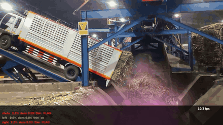

*Dust opacity scored per zone as a side tippler empties a truck. Public footage, qualitative run.*

| # | Problem | How it is solved | Evidence | Status |
|---|---------|------------------|----------|--------|
| 1 | [Dust opacity during tipping](#1-dust-opacity) | model + my own check | synthetic test set | shipped, unvalidated on real dust |
| 2 | [Burnt vs fresh cane](#2-burnt-vs-fresh-cane) | trained model | **8,612 real CCTV images** | works, camera-bound |
| 3 | [Burnt cane mixed into a load](#3-burnt-cane-mixed-in) | **no model, colour only** | simulated mixes | rule found, threshold unset |
| 4 | [Soil / trash / dirty area](#4-dirty-area) | trained model | 65 real images | inconclusive, data-bound |
| 5 | [Sand, rock, metal by sound](#5-acoustic-contaminants) | trained model, on sound | **real yard audio** | sand solved |
| 6 | [Cane flow on the carrier](#6-cane-flow-on-the-carrier) | trained model, teaches itself | **real mill video** | running at 70 fps |
| 7 | [Thai licence plate OCR](#7-thai-licence-plate-ocr) | **two readers, one with no model** | 60-image stress set | 0 wrong answers by design |
| 8 | [Is there cane on the truck?](#8-is-there-cane-on-the-truck) | **no model, edges only** | site deployment | 3.9 ms/frame |
| 9 | [Stalk segmentation](#9-stalk-segmentation) | trained model | 31 hand labels | supporting work |

## Two maps

Where each detector sits on the site:

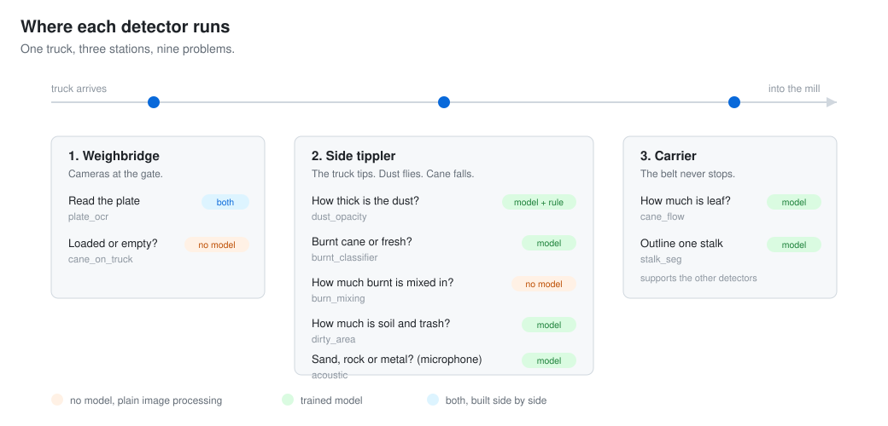

And how each one was solved. Some problems need a neural network. Two here did not get one,
because a rule I can read and explain was already enough:

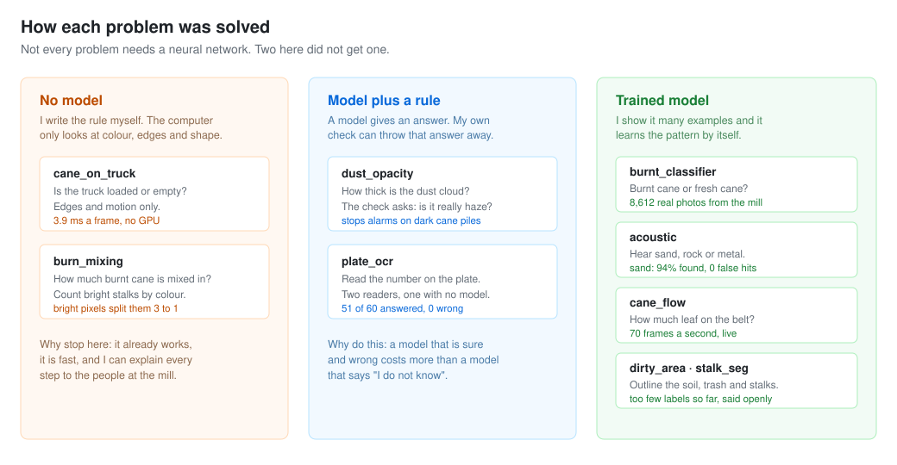

---

## 1. Dust opacity

**In plain words.** When a truck tips, dust flies up. The system watches the dust and says how thick it is. A model marks the dust pixels. Then my own check asks one question: does this really look like dust in the air? If not, the alarm is dropped.

How opaque the dust cloud gets when a truck tips its load, scored per bay, written to an
event log for mist-sprayer control and environmental reporting.

**Approach.** LR-ASPP segmentation with a density head (threshold 0.29), followed by a
*zone-evidence veto*: each bay's `detected%` is weighted by the fraction of pixels that
actually look like airborne haze. That removes false alarms from static black cane piles
and truck beds without retraining anything.

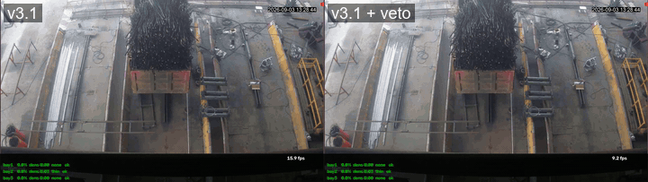

*Same clip, base model vs veto. The base model flags the dark pile; the veto does not.*

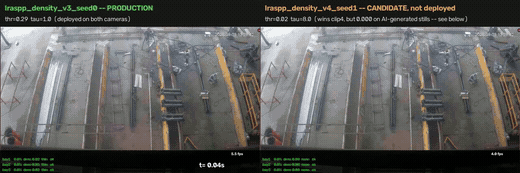

*Three bays scored independently in one frame, with per-bay event logging.*

**The honest limitation.** The scored test set contains no real photograph with dust in it.
Every positive sample is AI-generated; the two real photographs available show an empty yard
and both were training data. So every recall number is a *logic test of the pipeline on
synthetic input*, not a field accuracy. The clips above are qualitative demonstration runs on
public footage. They are not part of any scored evaluation, and a trustworthy false-positive
rate still needs fresh empty-yard footage the model has never seen.

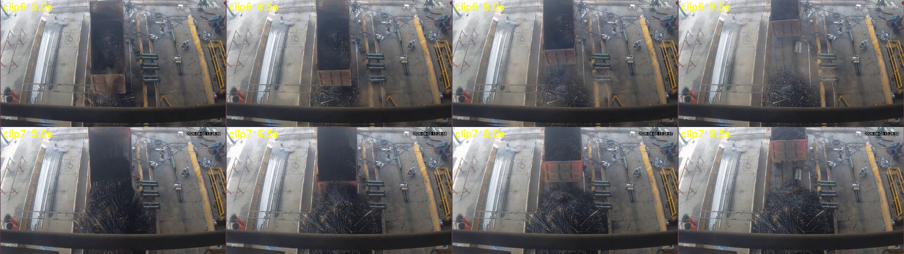

*Model generations on the same tipping clip.*

Before any learned model, the opacity equation itself was validated in simulation:

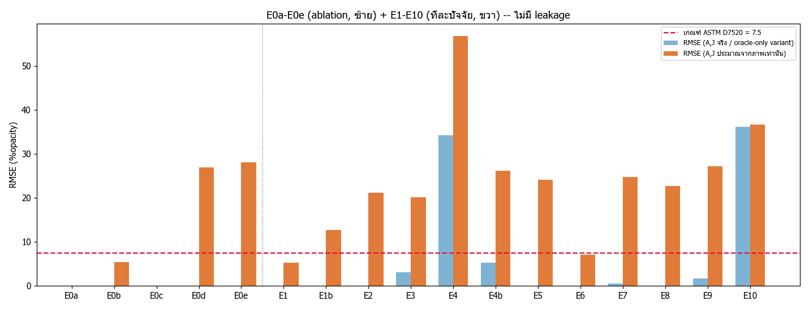

→ [`src/dust_opacity/`](src/dust_opacity/)

---

## 2. Burnt vs fresh cane

**In plain words.** Farmers sometimes burn the field before cutting. Burnt cane is worth less, so the mill pays less for it. The system looks at the load and says burnt or fresh.

Burnt cane is penalised at the weighbridge, so grading each truckload has direct commercial value.

**Data.** 8,612 real mill CCTV images, 4 classes, 6 days, 2 cameras (`MPDC00`, `MPK00`),
from the public `aimlsugarcane` Roboflow dataset (CC BY 4.0).

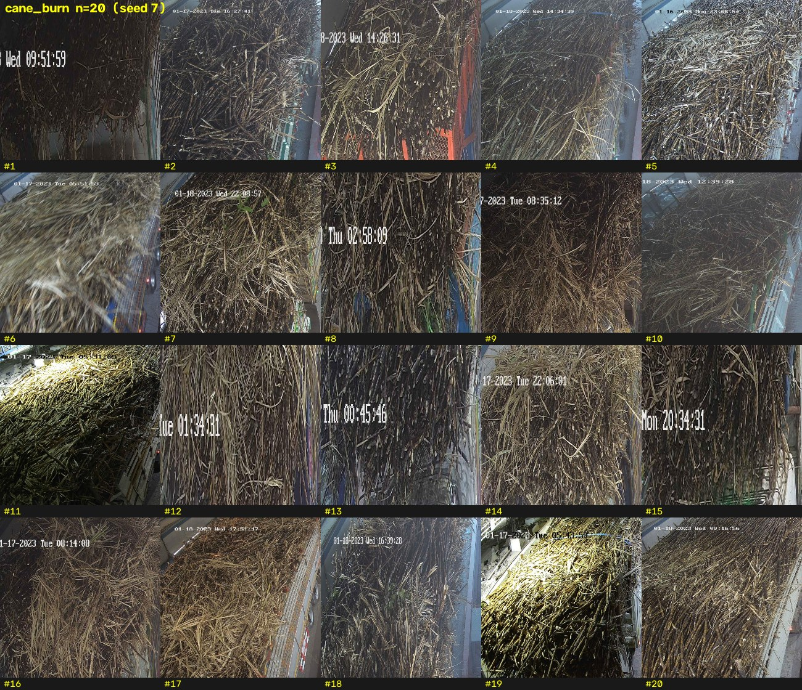

*Real burnt cane: pale grey-brown, dry matte stalks, leaves burned away.*

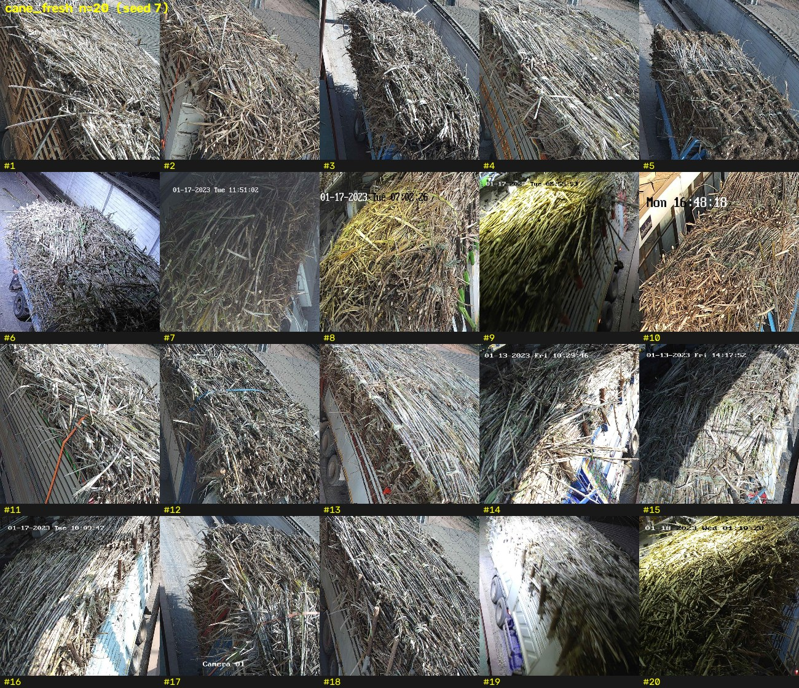

*Real fresh cane: leaves and sheaths still attached, lighter, and not "green".*

**This killed the original pipeline.** Everything built before this audit assumed burnt cane
was *glossy black* and fresh cane was *green*. Real burnt cane is neither. The separating
feature is **leaves present or absent, plus a dry pale surface**, so all synthetic training
data and every colour rule derived from it were invalid.

**Results.** EfficientNet-B0 @384px, 6 epochs, 5-fold cross-validation:

| | recall | precision | accuracy |
|---|---|---|---|
| mean over 5 folds | 0.873 ±0.117 | 0.843 ±0.108 | 0.9586 ±0.0069 |
| worst fold | 0.711 | 0.658 | 0.9500 |

Mean F1 **0.854**, against a camera-only baseline of **0.417**.

**The catch, reported up front.** Class and camera are almost perfectly confounded. 94% of
burnt examples come from one camera, 79% of fresh from the other, so a model can score well
by learning *which camera took the picture*. Split per camera, recall is **0.944 on MPDC00
and 0.415 on MPK00**. The lower number is the honest one, and every result here is reported
per camera for that reason.

→ [`src/burnt_classifier/`](src/burnt_classifier/)

---

## 3. Burnt cane mixed in

**In plain words.** A truck is rarely all burnt or all fresh. Most loads are a mix. This finds how much of the top is burnt. There is no model here. It just counts bright stalks, because burnt piles have almost none.

A load is rarely all-burnt or all-fresh. How much burnt surface is detectable before the
call flips?

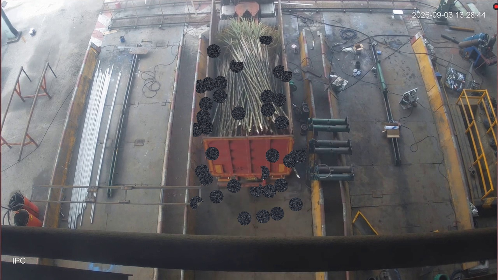

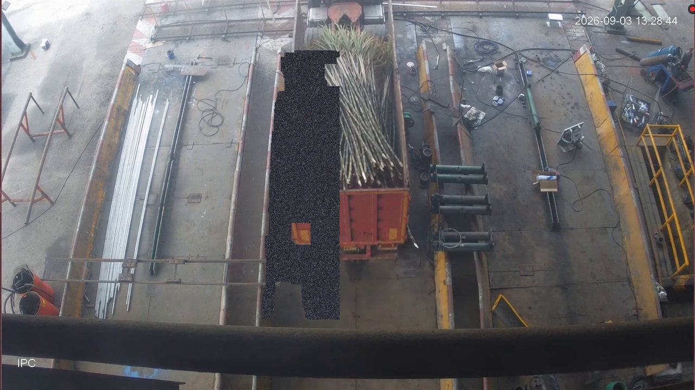

*Burnt surface pixels composited onto a fresh pile. Scattered patches vs one contiguous layer.*

- **`black%` is useless.** Fresh cane in truck-bed shadow reads 36.6% dark; burnt cane reads
  43-60%. The ranges overlap and texture gating does not separate them.
- **`bright%` works.** Burnt piles contain no bright stalks at all (0.6-6%); fresh piles always
  do, even in shadow (19-21%). A clean 3× gap.
- The 8/15 cut-off is a placeholder from two clips and must be re-set on real footage.
- Snapshots must be taken with the bed raised or after the dust settles, because dust brightens the
  pile and breaks the rule.

→ [`src/burn_mixing/`](src/burn_mixing/)

---

## 4. Dirty area

**In plain words.** Soil, tops and leaves come in with the cane, and the mill does not want to pay for dirt. This measures how much of the load is not real cane.

What share of a load is soil, tops and trash rather than millable cane.

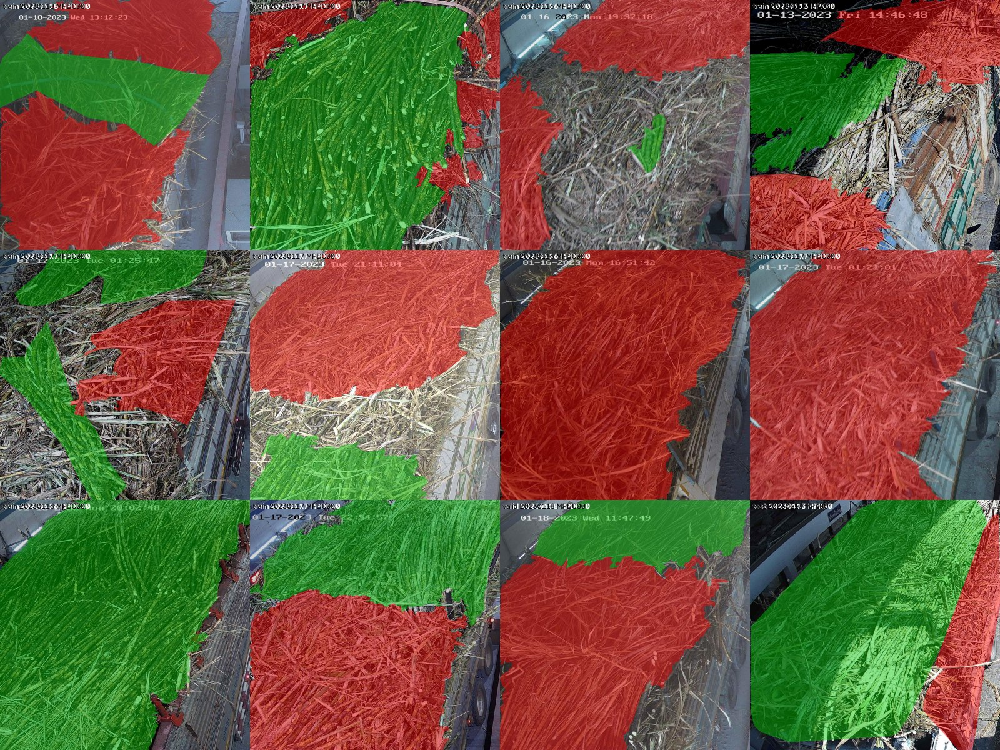

*Annotation montage. The label standard itself is the bottleneck.*

**Result: inconclusive, with the reason documented rather than hidden.**

- The `sugar-cane` class has **zero annotations** across all 158 images, so "fraction of the
  pile" cannot be computed. Only *dirty ÷ (dirty + clean labelled area)* is measurable, and
  that depends on how widely each annotator drew their boxes.
- The set is **65 original images**, Roboflow-augmented to 158. Real unit: 54 trucks.
- The published split leaks: one source image appears 3× in train and once in valid, which
  is 10% of a 10-image validation set.
- The cross-camera score of 0.842 **exactly equals** a majority-class baseline. The model
  learned nothing.

This does not show the task is impossible. It shows 65 images cannot decide it.

→ [`src/dirty_area/`](src/dirty_area/)

---

## 5. Acoustic contaminants

**In plain words.** Sand, rock and metal hide inside the load and break the machine. A camera cannot see inside. A microphone can hear them land. The sound is turned into a picture of its frequencies, and a small model reads that picture.

Metal, rock and sand riding in with the cane damage the shredder. Cameras cannot see inside a
load, but a microphone can hear it hit the carrier.

**Pipeline.** Generate impact and sand SFX with Stable Audio Open on a GTX 1060, filter them
through an acceptance test (1-10 kHz energy ≥0.35, attack ≤20 ms, decay ≤800 ms, peak/mean ≥6),
mix into **real** tipping-yard background at SNR +12 → −12 dB with millisecond ground truth,
then train a log-mel CNN. 57 clips generated, 30 passed, 80 test clips, 418 events.

Tested against real yard audio the model never saw:

| method | impact R / P | sand R / P | false alarms/min |
|---|---|---|---|
| energy threshold rule | 0.58 / 0.25 | 0.35 / n/a | 7.6 |
| **CNN, 0.5 s window** | 0.47 / **0.59** | **0.94 / 1.00** | **2.2** |
| CNN, 0.25 s window | **0.59** / 0.35 | 0.98 / 0.995 | 7.2 |

**Sand flow is solved.** 94-98% recall at essentially perfect precision on real audio, the
strongest result in the project. The CNN beats the rule on precision by 2.4× and cuts false
alarms 3.5×, because it learns *not* to fire on cane hitting the rail, chains and hammers.

→ [`src/acoustic/`](src/acoustic/)

---

## 6. Cane flow on the carrier

**In plain words.** After tipping, the cane rides a belt into the mill. The belt never stops, so the system must keep up. It watches the belt and says how much of it is leaf instead of cane.

Once the cane is tipped it rides a carrier into the shredder. Segmenting the leaf fraction of
the moving mat gives a continuous quality signal instead of one snapshot per truck.

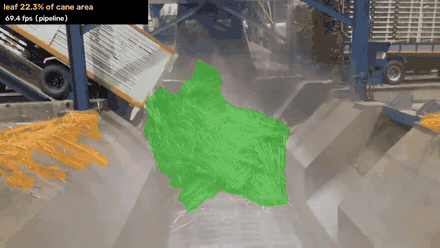

*Leaf area segmented on real mill video, live percentage overlaid, at **69.9 fps end to end**.*

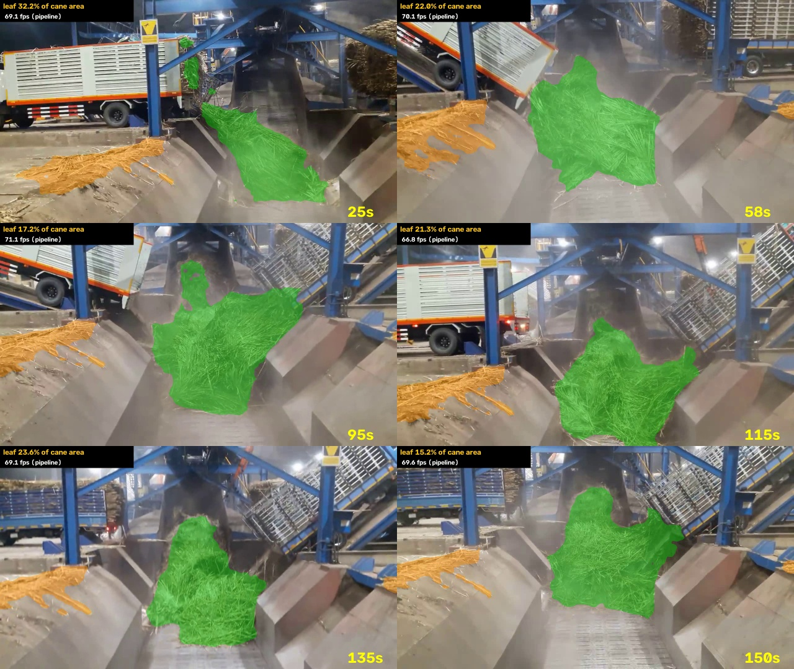

*Frames sampled across a run. Labels were bootstrapped by self-training from a small hand-labelled seed.*

The interesting constraint here is throughput, not accuracy: a carrier never stops, so the
segmenter has to keep up with the belt on hardware the mill already owns.

→ [`src/cane_flow/`](src/cane_flow/)

---

## 7. Thai licence plate OCR

**In plain words.** Every truck needs the right farmer's name on it, so the plate must be read. The rule here is simple: it is better to say nothing than to say the wrong number. If the picture is bad, it asks a person.

Reading the truck's plate at the weighbridge so each load attaches to the right supplier.
Thai lorry plates are numeric (`83-6237`) in a single national font, which makes them a
better-posed problem than general OCR.

Two independent engines are implemented:

| engine | how it reads | why it exists |
|---|---|---|
| **ONNX + OpenCV** | learned detector, ONNX reader, cross-frame voting | accuracy |
| **pure CV** | morphology → connected components → template correlation | zero ML, runs on a Raspberry Pi, every step explainable |

**The design rule: if it answers, it must be right.** The goal is not reading every truck.
it is that every plate written to the CSV is trustworthy. Weak evidence returns
`accepted=false` with a reason and goes to a human. One wrong row costs more than ten
confirmations.

Strict mode, 60-image stress set (plates composited onto truck scenes, then degraded with
blur, skew, darkness, glare, noise, JPEG q40, small size, off-template fonts), CPU only:

| | before tuning | after tuning |
|---|---|---|
| answered | 48/60 | **51/60** |
| of those, correct | 48 | **51** |
| **of those, wrong** | **0** | **0** |
| sent to a human | 12 | 9 |
| median time/image | 2,236 ms | **182 ms** |

The row that matters is **wrong = 0**; "sent to a human" is the price paid for it.
This is a controlled synthetic set for comparing engines and catching regressions. It is
**not** a field accuracy, which depends on camera, lighting and how dirty the plate is.

→ [`src/plate_ocr/`](src/plate_ocr/)

---

## 8. Is there cane on the truck?

**In plain words.** Before anything else, one camera checks if the truck is full or empty. There is no model at all. It looks at edges and movement, and it runs in under 4 milliseconds.

The side camera decides whether an arriving truck is loaded or empty, and triggers the paired
capture with the front camera.

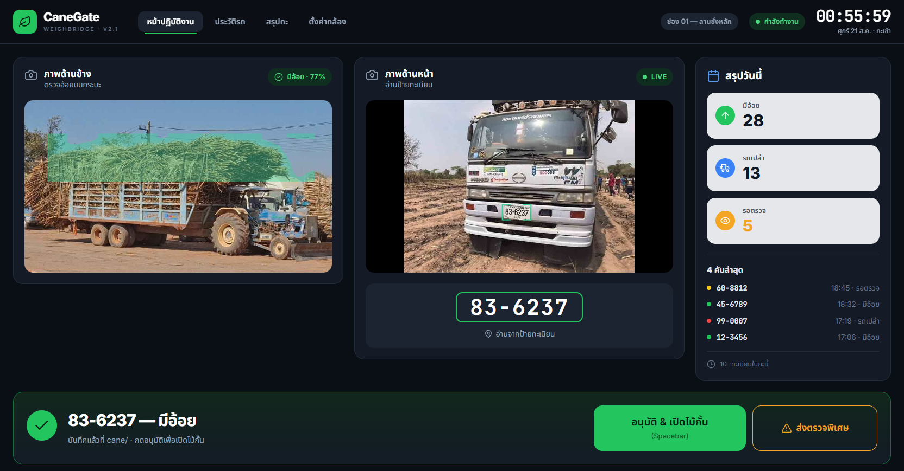

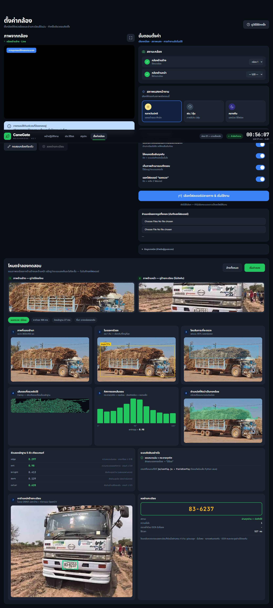

*Every stage the system sees, from locating the truck to the load decision.*

Measured on CPU, no GPU:

| layer | frequency | time |
|---|---|---|
| computer vision (motion + tracker) | every frame | **3.9 ms**, headroom to ~250 fps |
| truck localisation (YOLO11n, web worker) | occasional | 280 ms |
| cane classification (cue + fusion) | once per truck | 9 ms |
| plate read (ONNX + verification) | once per truck | 0.2-2.5 s |

The cane decision itself uses **no trained model**. It is cue fusion over classical features,
with a test suite pinning the Python and browser implementations to identical numbers. Runs
fully offline at the weighbridge.

→ [`src/cane_on_truck/`](src/cane_on_truck/)

---

## 9. Stalk segmentation

**In plain words.** This draws the shape of each stalk. On its own it is not useful. It helps the other detectors measure things properly instead of guessing from colour.

Supporting work: separating individual stalks so downstream features (leaf fraction, stalk
length, orientation) can be measured rather than guessed from whole-image colour.

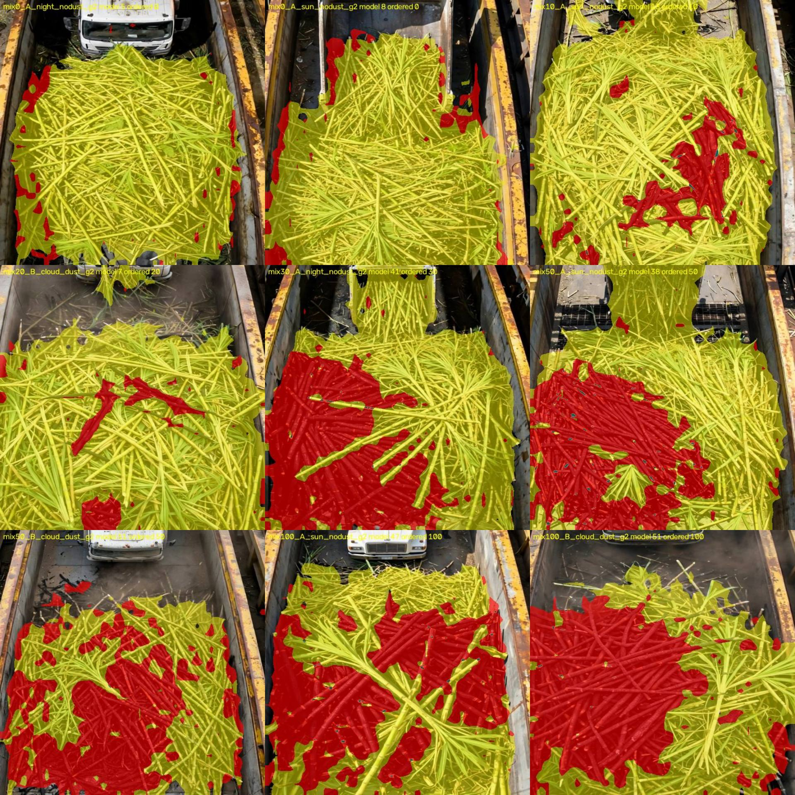

*Frozen DINOv2 backbone with a two-layer head, trained on 31 hand-labelled images.*

→ [`src/stalk_seg/`](src/stalk_seg/)

---

## How results are reported here

1. Numbers come from held-out data split along the structure that matters, by day and by
   camera, never a random shuffle.
2. Accuracy is always paired with coverage: how many cases the model agreed to answer at all.
3. Failures are written down with the same weight as successes. The burnt-cane colour
   assumption, the dirty-area dataset and the dust test set are all documented as unusable,
   because a number that cannot be defended is worse than no number.

The methodology this follows is packaged separately as
[`model-proof-loop`](https://github.com/watcharaponthod-code/model-proof-loop).

## Credits

Real mill imagery from the `aimlsugarcane` Roboflow dataset (CC BY 4.0).
Carrier and tippler footage from public video; audio backgrounds recorded at the yard.
Code MIT licensed.
